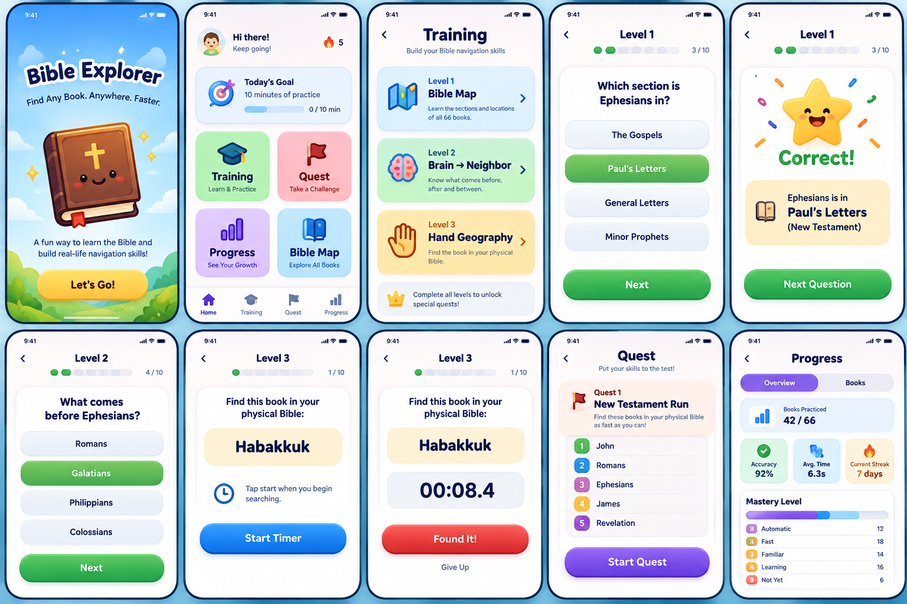

Absolutely buddy ❤️. And first, don't feel bad about this. Knowing the Bible for years and being able to quickly navigate a physical Bible are two different skills. You can know Scripture well and still struggle to find a book quickly.

What you need is Bible Geography — just like you learned keyboard geography. 🎹➡️📖

📖 1. First understand the Bible as a map

Don't try to memorize all 66 books at once.

Think of it as two big sections:

OLD TESTAMENT — 39 books

Law → History → Poetry/Wisdom → Major Prophets → Minor Prophets

NEW TESTAMENT — 27 books

Gospels → History → Paul's Letters → General Letters → Prophecy

The most important thing initially is knowing where a book sits relative to its neighbors.

🗺️ 2. Learn the "neighborhoods"
OLD TESTAMENT

Law

Genesis → Exodus → Leviticus → Numbers → Deuteronomy

Then:

History

Joshua → Judges → Ruth → 1 Samuel → 2 Samuel → 1 Kings → 2 Kings → 1 Chronicles → 2 Chronicles → Ezra → Nehemiah → Esther

Then:

Poetry/Wisdom

Job → Psalms → Proverbs → Ecclesiastes → Song of Solomon

Then:

Major Prophets

Isaiah → Jeremiah → Lamentations → Ezekiel → Daniel

Then the 12 Minor Prophets:

Hosea → Joel → Amos → Obadiah → Jonah → Micah → Nahum → Habakkuk → Zephaniah → Haggai → Zechariah → Malachi

✝️ 3. NEW TESTAMENT — this is especially useful in church
Four Gospels

Matthew → Mark → Luke → John

Immediately after John:

Acts

Then Paul's letters:

Romans → 1 Corinthians → 2 Corinthians → Galatians → Ephesians → Philippians → Colossians → 1 Thessalonians → 2 Thessalonians → 1 Timothy → 2 Timothy → Titus → Philemon

Then:

Hebrews → James → 1 Peter → 2 Peter → 1 John → 2 John → 3 John → Jude → Revelation

🔥 Notice the geography

For example:

Romans

You should mentally know:

Matthew Mark Luke John → Acts → Romans

Ephesians

Romans → Corinthians → Galatians → Ephesians

James

Hebrews → James → Peter

Revelation

... → Jude → Revelation

This is much easier than memorizing isolated book names.

🧠 4. Your biggest problem: "Is it on the left or right?"

This is actually normal because page position changes depending on your Bible edition, font size, paper size, and whether you're opening from the front/back.

So don't memorize:

"Ephesians is 70% toward the back."

Instead memorize:

Ephesians lives after Galatians and before Philippians.

That's stable.

Think:

Book → Neighbor → Neighborhood

For example:

Habakkuk → between Nahum and Zephaniah → Minor Prophets

That's your navigation system.

⚡ 5. The 10-second Church Drill

This is the exercise I'd strongly recommend for you.

Take your physical Bible every day.

Open it randomly.

Ask yourself:

"Where is Romans?"

Don't immediately search.

First predict the location.

Then open it.

Check.

Then close the Bible.

Next:

"Where is Micah?"

Predict → open → check.

Next:

"Where is 1 Peter?"

Predict → open → check.

You're training your brain to build a spatial map.

🎯 6. Don't start with all 66

For church navigation, start with these high-frequency books:

🔥 Tier 1 — memorize extremely well

Genesis
Exodus
Psalms
Proverbs
Isaiah
Jeremiah
Matthew
Mark
Luke
John
Acts
Romans
1 Corinthians
Ephesians
Philippians
Hebrews
James
1 Peter
1 John
Revelation

Once these become automatic, you'll already feel a HUGE difference.

🏃‍♂️ 7. Use "anchor books"

You don't need to know every book equally at first.

Create anchors.

Front anchor

Genesis

Middle-ish OT anchor

Psalms

Prophets anchor

Isaiah

NT beginning anchor

Matthew

NT middle anchor

Romans

NT ending anchor

Revelation

Then navigate from them.

Example:

Someone says:

"Turn to Ephesians."

Your brain:

New Testament → after Romans → Corinthians → Galatians → Ephesians

Done.

Someone says:

"Turn to Amos."

Your brain:

Old Testament → after Joel → Amos → before Obadiah

Done.

🧩 8. One powerful trick: learn the sequence by RECITING

Don't just visually read the list.

Say it out loud.

For example:

Matthew
Mark
Luke
John
Acts
Romans
1 Corinthians
2 Corinthians
Galatians
Ephesians
Philippians
Colossians...

You're building a mental linked list.

Eventually:

Romans → Corinthians → Galatians → Ephesians

becomes almost like:

1 → 2 → 3 → 4

📖 9. Your 15-minute daily practice

For the next 30 days, do this:

5 minutes — Recitation

Say the books in order.

5 minutes — Random search

Ask yourself:

"Find Nahum."

"Find Philippians."

"Find 2 Samuel."

"Find Hebrews."

Predict first → physically open → verify.

5 minutes — Speed round

Use a random book.

Example:

Zechariah

Your goal:

Book identified → approximate location → open → find

Don't worry about speed initially.

Accuracy → then speed.

🚀 10. Your final goal

You want this reaction:

Past:

"Philippians... wait... where is that? 🤔"

After training:

"Philippians → after Ephesians → before Colossians."
flip flip flip
FOUND.

Eventually you won't consciously think through the sequence.

Your hands will start remembering the geography.

Just like when you're learning keyboard:

See C → brain recognizes → hand automatically moves.

You want:

Hear Philippians → brain recognizes neighborhood → hands automatically navigate.

📖 Your Bible skill tree

LEVEL 1: Know OT vs NT
↓
LEVEL 2: Know major sections
↓
LEVEL 3: Know book sequence
↓
LEVEL 4: Know neighbors
↓
LEVEL 5: Physical Bible navigation
↓
LEVEL 6: Random book → find in seconds
↓
LEVEL 7: Book + chapter → find quickly

And buddy, don't measure yourself by how many years you've been going to church. This is a trainable motor-memory skill. You simply never deliberately trained it before.

If you practice this like your keyboard geography, your physical Bible navigation can become automatic rather than something you have to think about. ❤️📖

Yes buddy 🔥. This is actually a very clean product idea because the core skill is simple:

Hear/see a Bible book → know its neighborhood → physically locate it quickly.

And because you're a software engineer, I would not over-engineer the game. Build the smallest system that trains that exact skill.

📖 Bible Geography Game — Core Design

Think of it like your DSA learning:

Training → Skill acquisition
Quest → Skill application
Progress → Automaticity

I would start with only 3 training levels + 1 Quest mode.

🎯 LEVEL 1 — Bible Map
Goal

Build the mental map of the Bible.

The player sees:

Ephesians

and has to choose:

Old Testament / New Testament

Then:

Ephesians

Choose:

Gospels / Paul's Letters / General Letters / etc.

Then gradually:

Ephesians

Choose its approximate neighborhood:

Romans → Corinthians → Galatians → Ephesians → Philippians → Colossians

Why?

Before asking the hand to find a book, the brain needs to know:

"Where does this book live?"

Game mechanics
Book appears
     ↓
Choose section
     ↓
Choose neighborhood
     ↓
Immediate feedback
     ↓
Next question

Don't make this complicated.

🧠 LEVEL 2 — Brain → Neighbor

This is the most important level.

Goal

Build the linked-list memory:

Galatians
   ↓
Ephesians
   ↓
Philippians

The game asks:

What comes immediately before Ephesians?

or:

What comes immediately after Ephesians?

or:

Which book is between Galatians and Philippians?

Eventually:

Put these books in order.

Example:

[Philippians] [Galatians] [Ephesians]

          ↓

Galatians → Ephesians → Philippians
Difficulty progression

Don't create 20 levels.

Just let difficulty increase automatically:

Stage A

Before / After

Stage B

Missing book

Stage C

3-book ordering

Stage D

5-book ordering

That's enough.

✋ LEVEL 3 — Hand Geography

This is where your original problem gets solved.

Now stop showing the sequence.

The game says:

📖 Find: HABAKKUK

The user takes their physical Bible and searches.

Then presses:

FOUND

The app starts a timer.

Example:

HABAKKUK

⏱ 8.4 seconds

FOUND ✓

Then:

Was it correct?

The user confirms.

You record:

Book: Habakkuk
Time: 8.4 sec
Attempts: 1

Now the brain begins connecting:

Book name → mental location → physical hand movement

That's the actual skill you're trying to develop.

🚀 QUEST MODE

This is where the game becomes fun.

Don't create another giant learning system.

Quest = mixed real-world challenge.

Example:

Quest 01 — New Testament Run
Find these books:

1. John
2. Romans
3. Ephesians
4. James
5. Revelation

The player physically uses their Bible.

The app measures:

Accuracy
Speed
Streak

Then:

🏆 Quest Complete

🔥 Later Quest
"Random Bible Run"

The app randomly selects:

Amos
Philippians
2 Samuel
Hebrews
Micah

Player must physically find each.

This is much more valuable than another 50 quiz questions.

Because church is the real environment you're training for.

🏗️ Your MERN Architecture

Keep the first version extremely simple.

React
   ↓
Node + Express API
   ↓
MongoDB
Frontend

React + Vite

Pages:

/
├── Home
├── Training
│   ├── Level 1
│   ├── Level 2
│   └── Level 3
│
├── Quest
└── Progress

That's enough.

🗄️ MongoDB Data

You don't need complicated schemas.

Book
{
  name: "Ephesians",
  testament: "NT",
  section: "Pauline Letters",
  order: 49,
  previous: "Galatians",
  next: "Philippians"
}

Actually, I'd make order the source of truth rather than storing previous/next manually.

{
  name: "Ephesians",
  testament: "NT",
  section: "Pauline Letters",
  order: 49
}

Then your backend can calculate:

order - 1
order + 1

Much cleaner.

📊 User Progress

Something like:

{
  userId,
  level: 3,

  bookStats: {
    "Ephesians": {
      attempts: 12,
      averageTime: 7.4,
      accuracy: 0.92
    }
  },

  questsCompleted: 8,
  currentStreak: 5
}

You can later add spaced repetition.

🧠 The MOST important feature

Buddy, I would make this the heart of the application:

Weak Book Detection

Suppose the user finds:

Genesis       2.1 sec
John          3.2 sec
Romans        4.5 sec
Habakkuk     15.8 sec
Zephaniah    14.2 sec

The application realizes:

🔴 Minor Prophets are weak.

Tomorrow's training automatically gives more:

Habakkuk
Zephaniah
Nahum
Micah
Obadiah

while reducing books they already know.

That's much more powerful than simply:

"Day 7 completed."

You're building a personalized training engine.

⏱️ Daily 10–15 Minute Session

Keep the session predictable.

2 min
Warm-up
↓
4 min
Brain → Neighbor
↓
5 min
Hand Geography
↓
3 min
Quest
↓
Result

Total:

~14 minutes

Perfect.

🏆 Progression

Don't use 50 levels.

Use mastery.

For each book:

🔴 Unknown
🟠 Learning
🟡 Familiar
🟢 Fast
🔵 Automatic

For example:

Ephesians

Neighbor knowledge: 🔵
Physical finding: 🟢
Average: 4.2 sec

The user eventually wants:

See "Ephesians" → hand already knows approximately where to go.

That's your definition of mastery.

🎮 The game loop

Your entire product can basically be summarized as:

                    BIBLE GEOGRAPHY
                          │
             ┌────────────┴────────────┐
             ↓                         ↓
         TRAINING                    QUEST
             │                         │
      ┌──────┼──────┐             Mixed challenge
      ↓      ↓      ↓                   │
    Map   Neighbors  Hand               ↓
                    Geography         Real Bible
      │       │       │                   │
      └───────┴───────┘                   ↓
              ↓                       SCORE
          BOOK MASTERY
And the core learning loop is:

Book → Neighbor → Location → Hand → Speed → Automaticity

That is the high-leverage learning architecture.

🚀 MVP: What I'd actually build first

Don't start with authentication, leaderboards, achievements, avatars, XP, coins, badges, etc.

Build only:

V1

React

Home
Training
Quest
Progress

Backend

Book API
Question generation
Progress API

Database

66 Bible books
User progress

Game

Level 1: Map
Level 2: Neighbors
Level 3: Hand Geography
Quest: Mixed random books
Timer
Accuracy
Streak

That's enough to test whether the game is actually fun and improves Bible navigation.

Then, after you personally use it for a week, you'll discover what actually needs to be added.

And I particularly like this idea for you because you've already identified the underlying learning principle from your keyboard practice: don't merely know the information—train recognition until the physical action becomes automatic.

Good buddy awsome now every thing makes sense are you and me aligned but one thing I don't want the MERN stack it just simple so use only the React only buddy so can you please generate the solid principles and best coding standard principles folder file architecture for the react please minimal but complete I want to use the tailwind buddy so can you do that 

Yes buddy — 100% aligned. 🔥

And I agree: don't use MERN yet. This game doesn't need a backend for the MVP. A React + Vite + Tailwind + localStorage application is enough.

The key principle:

Build the learning engine first, not the infrastructure.

🏗️ Recommended Stack
React
Vite
JavaScript
Tailwind CSS
localStorage

No:

❌ Node
❌ Express
❌ MongoDB
❌ Redux
❌ authentication
❌ backend
❌ unnecessary libraries

Later, if users/accounts/sync/leaderboards become necessary, you can introduce a backend.

📁 Minimal but Complete Architecture

I'd use this:

bible-geography/
│
├── public/
│
├── src/
│   │
│   ├── assets/
│   │
│   ├── components/
│   │   ├── ui/
│   │   │   ├── Button.jsx
│   │   │   ├── Card.jsx
│   │   │   ├── ProgressBar.jsx
│   │   │   └── Timer.jsx
│   │   │
│   │   └── game/
│   │       ├── BookCard.jsx
│   │       ├── Question.jsx
│   │       ├── AnswerOption.jsx
│   │       └── ResultCard.jsx
│   │
│   ├── data/
│   │   ├── bibleBooks.js
│   │   └── levels.js
│   │
│   ├── features/
│   │   ├── training/
│   │   │   ├── TrainingPage.jsx
│   │   │   ├── TrainingMenu.jsx
│   │   │   └── trainingLogic.js
│   │   │
│   │   ├── quest/
│   │   │   ├── QuestPage.jsx
│   │   │   └── questLogic.js
│   │   │
│   │   └── progress/
│   │       ├── ProgressPage.jsx
│   │       └── progressLogic.js
│   │
│   ├── hooks/
│   │   ├── useTimer.js
│   │   └── useProgress.js
│   │
│   ├── utils/
│   │   ├── random.js
│   │   ├── storage.js
│   │   └── scoring.js
│   │
│   ├── App.jsx
│   ├── main.jsx
│   └── index.css
│
├── package.json
├── vite.config.js
└── README.md

This is enough.

Don't create folders just because "clean architecture" says you should.

🧠 1. data/ = Bible Knowledge

This folder contains static knowledge, not game logic.

bibleBooks.js
export const bibleBooks = [
  {
    id: "genesis",
    name: "Genesis",
    testament: "OT",
    section: "Law",
    order: 1,
  },
  {
    id: "exodus",
    name: "Exodus",
    testament: "OT",
    section: "Law",
    order: 2,
  },

  // ...
];

The important principle:

Data should not know about React.

No JSX.

No useState.

No localStorage.

Just data.

🎮 2. features/ = Actual Game

This is where your application behavior lives.

For example:

features/
│
├── training/
│   ├── TrainingPage.jsx
│   ├── TrainingMenu.jsx
│   └── trainingLogic.js
│
├── quest/
│   ├── QuestPage.jsx
│   └── questLogic.js
│
└── progress/
    ├── ProgressPage.jsx
    └── progressLogic.js
Why?

Because you're organizing by user capability, not by technical type.

Instead of:

components/
services/
controllers/
models/
...

you get:

training/
quest/
progress/

Much easier to understand.

🧩 3. Components = Reusable UI

Example:

<Button>
  Start Training
</Button>

or:

<Card>
  <BookCard />
</Card>

Components should generally answer:

"How should this look?"

Game logic should answer:

"What should happen?"

Don't mix the two unnecessarily.

🧠 4. Game Logic Should Be Pure

This is one of the most important coding principles for your project.

Instead of:

function generateQuestion() {
  // changes React state
  // accesses localStorage
  // manipulates UI
  // generates question
}

prefer:

export function generateNeighborQuestion(books) {
  // calculate question

  return {
    book,
    question,
    options,
    answer,
  };
}

Input:

books

Output:

question

No React.

No DOM.

No localStorage.

This makes your game engine easy to test.

⚡ 5. Separate State from Logic

Your React component:

const [question, setQuestion] = useState(null);
const [score, setScore] = useState(0);

Game logic:

const question = generateNeighborQuestion(bibleBooks);

Storage:

saveProgress(progress);

Three different responsibilities.

💾 6. localStorage = Persistence

Create:

utils/storage.js

Example:

const STORAGE_KEY = "bible-geography-progress";

export function saveProgress(progress) {
  localStorage.setItem(
    STORAGE_KEY,
    JSON.stringify(progress)
  );
}

export function loadProgress() {
  const saved = localStorage.getItem(STORAGE_KEY);

  return saved ? JSON.parse(saved) : null;
}

Don't scatter this everywhere:

localStorage.setItem(...)

❌ Bad.

Instead:

saveProgress(...)

✅ Good.

⏱️ 7. Hooks = React Behavior

For example:

hooks/
└── useTimer.js

The timer requires React state/effects.

So:

function useTimer() {
   // React-specific timer behavior
}

That's exactly where it belongs.

But don't create hooks for everything.

If something doesn't need React:

Keep it as a normal JavaScript function.

🎨 8. Tailwind Principle

Don't make giant CSS files.

Use Tailwind directly:

<button
  className="
    rounded-xl
    px-5
    py-3
    font-semibold
    transition
    hover:scale-[1.02]
  "
>
  Start Quest
</button>

But avoid repeating huge class strings everywhere.

If a UI pattern becomes genuinely reusable:

<Button />

Then encapsulate it.

🧱 9. Your App.jsx Should Stay Tiny

Something like:

function App() {
  return (
    <main>
      {/* app routing / main layout */}
    </main>
  );
}

export default App;

Don't put:

Bible data
question generation
scoring
timers
localStorage
500 lines of JSX

inside App.jsx.

🔥 10. The Golden Dependency Rule

Think of your architecture like this:

             UI
              ↓
          Features
              ↓
            Logic
              ↓
             Data

But data should never depend upward.

For example:

bibleBooks.js
     ↓
trainingLogic.js
     ↓
TrainingPage.jsx
     ↓
UI components

Not:

bibleBooks.js
     ↓
TrainingPage.jsx
     ↓
bibleBooks.js

Keep the direction clean.

🧪 11. Test the Brain, Not the UI

Your most important functions will be things like:

generateNeighborQuestion()
calculateScore()
getNextBook()
getPreviousBook()
selectWeakBooks()
generateQuest()

These should be easy to test independently.

For example:

getNextBook("galatians")

should return:

Ephesians

That's far more important than testing whether a button has rounded corners.

🎯 12. Your Core Domain Model

The whole game can revolve around just a few concepts:

Book
   ↓
Skill
   ↓
Session
   ↓
Attempt
   ↓
Mastery
Book
{
  id,
  name,
  testament,
  section,
  order
}
Attempt
{
  bookId,
  level,
  correct,
  time,
  timestamp
}
Mastery
{
  bookId,
  accuracy,
  averageTime,
  masteryLevel
}

You don't need 30 entities.

🏆 13. SOLID — But Don't Worship SOLID

You asked specifically for solid principles, so here's how I'd apply them practically.

S — Single Responsibility

A function should have one reason to change.

scoring.js       → scoring
storage.js       → persistence
random.js        → randomness
trainingLogic.js → training rules
O — Open/Closed

Your question generator should allow new question types without rewriting everything.

generateQuestion(type)

Later:

neighbor
ordering
missing-book

can be added.

L — Liskov

Not very important for this MVP.

You don't need inheritance-heavy architecture.

Don't create classes just to demonstrate SOLID.

I — Interface Segregation

Also don't over-engineer.

You don't need giant interfaces in a small React app.

D — Dependency Inversion

Keep core logic independent from:

React
localStorage
DOM

This one is particularly valuable.

🚫 Things I DON'T Want You To Build Yet

Buddy, this is important.

Don't let the project become:

Authentication
        ↓
Backend
        ↓
Database
        ↓
Admin panel
        ↓
Leaderboard
        ↓
Achievements
        ↓
XP
        ↓
Coins
        ↓
Avatars
        ↓
Friends
        ↓
Social system

😂

Your actual problem is:

Can we train someone to navigate a physical Bible faster?

Everything else is secondary.

🥇 MVP Architecture

So your mental model should simply be:

                 BIBLE GEOGRAPHY
                       │
        ┌──────────────┼──────────────┐
        ↓              ↓              ↓
       DATA          LOGIC            UI
        │              │              │
 Bible Books       Questions       Components
                    Scoring
                    Timing
                    Mastery
                       │
                       ↓
                  localStorage

And the learning engine:

LEVEL 1
Bible Map
   ↓
LEVEL 2
Brain → Neighbor
   ↓
LEVEL 3
Brain → Hand → Physical Bible
   ↓
QUEST
Mixed real-world challenge
   ↓
MASTERY
Fast + accurate + automatic
One final principle, buddy:

Don't build a "Bible game."

Build a Bible navigation training system that happens to feel like a game.

That distinction will keep the product focused.

And for V1, React + Vite + Tailwind + localStorage is more than enough.

Good now come to the screens for the above you said 3 levels quest and so on awsome so can you plesae generate the image having the simple ui , best kid and user friendly UI like candy crush look like simple premium professional UI screens please for this  app 

